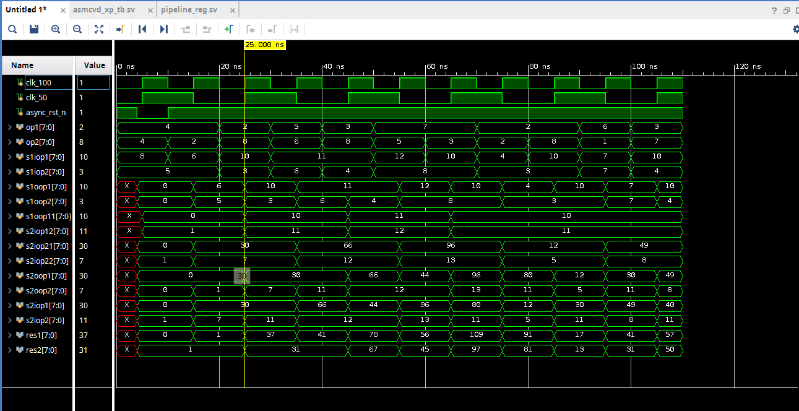

# bi-tribble
Experimental implementation of multi-clock synchronous digital logic
Design consists of sequential datapath. The design blocks are as follows.

The objective is to operate slower logic in parallel fashion with time multiplexing to avoid it's affect on the system clock.

### Procedure

- The operation is simple `ADD->MULTIPLY->ADD`
- 100MHz clock is fed into pipeline stages.
- A demux distributes the between each multiplier.
- 50MHz clock is fed into mux and demux, `MUL1@CLK`,`MUL2@~CLK`

### Timing Diagram

### Explanation

- RESET is asserted, registers flush
- Addition is combinationally performed, the results are transparent after the pipeline stage.
- The Stage-1 output data is distributed to MUL1 and MUL2 depending on clock_50MHz (high and low).
- Multiplication is combinationally performed, the mux selects the appropriate source and the results are transparent to output at 3rd cycle.
- Some 1's in the early stages because of `add + 1` logic in ADD and MUL to create second operand for later stage.

### Synthesis
The elaborated schematic (pre-synth) is as follows:
https://github.com/aitesam961/bi-tribble/blob/main/schematic.pdf   

This design works as intended in the Behavioural simulations but synthesis with Xilinx Vivado infers latches before multiplier (as a substitute for demux, vivado doesn't support demux) probably to keep results buffered after the cycle is over. 

One alternative could be to make the multipliers clock sensitive but that means additional clock cycle before the result would be transparent.

### Outcome

