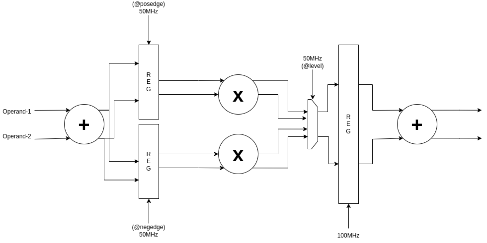

# bi-tribble
**Experimental implementation of multi-clock synchronous digital logic.**
Design consists of a sequential datapath. The design blocks are as follows.

The objective is to operate slower logic in parallel fashion with time multiplexing to avoid it's affect on the system clock.

## Procedure

- The operation is simple `ADD->MULTIPLY->ADD`
- 100MHz clock is the datapath operating frequency i.e new data enters every 10ns.
- Pipeline registers at stage-1 operate in parallel yet at opposite timings of 50meg clock. (posedge/negedge)
- MUX (level sensitive) operates at 50MHz to select the source multiplier.
- Each multiplier's result is sampled after 20ns (50MHz).
- Datapath delivers the results after 30ns (ideal & best case).

## Timing Diagram
The timing diagram presents behavioural simulation of logic.
Obtained using Vivado Design Suite, XSIM simulator. The results are verified by post synthesis functional simulation as well.

## Explanation
Please follow the waveform for better understanding.

- cycle-1: RESET Active, NOP, operand pair-1 missed
- cycle-2: Addition is performed combinationally. The results are transparent to respective multiplier.
- cycle-3: Multiplication is performed combinationally, the selected results are transparent to the ADDR-2.
- cycle-3: Final addition is performed and the results `res1` is available.

### Attempt-1 (Failed)

I tried to implement a demux between MUL and Stage-1 register but Vivado synthesis tool doesn't allow demux. The behavioural simulation worked but synthesis inferred latches to complement demux. The output was incorrect.

### Attempt-2 (Failed)

I changed the multipliers to sequential (clock sensitive) but that turned out to take additional cycle before the results are returned. The duty cycle was much delayed as multipliers take long time to settle the output for next register.

### Attempt-3 (Success)
I split the stage-1 registers. Now they sample the inputs in a time-multiplexed fashion thus making the design possible and functional post synthesis.

### Outcome
Even though the system is functional, I have some magnitude of dissatisfaction over it.

I initially wanted to complement slower logic by compromising more area. In short, time-muxing multiple instances of slower logic to avoid delaying clock.
Ideally, I was expecting the results as follow:

- **clk_high@100MHz (10ns cycle)**
- **clk_slow@50MHz (20ns cycle)**
- **Logic: ADD->MUL->ADD**

